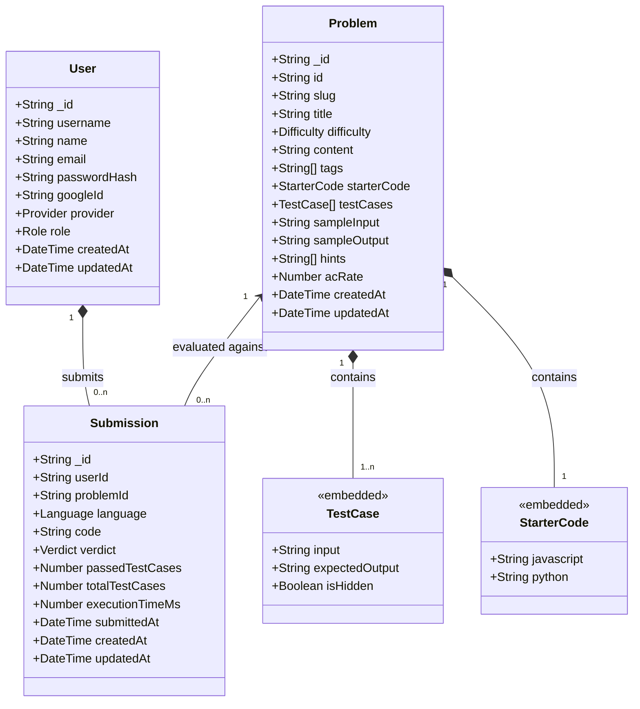

# Database Design — Nexorithm Online Judge

## Entities and Relationships

Here is the exact Mermaid Class Diagram modeled strictly 1:1 against the underlying MongoDB/Mongoose schema architecture.

It reflects the exact Mongoose schema types (ObjectIds, native enums, embedded sub-documents, and foreign key references).



---

## Enum Definitions

The Mongoose schema enforces strict enumeration constraints across the database:

```sql
CREATE TYPE Role       AS ENUM ('user', 'admin');
CREATE TYPE Provider   AS ENUM ('local', 'google');
CREATE TYPE Difficulty AS ENUM ('easy', 'medium', 'hard');
CREATE TYPE Language   AS ENUM ('javascript', 'python');
CREATE TYPE Verdict    AS ENUM ('Accepted', 'Wrong Answer', 'Runtime Error', 'Time Limit Exceeded', 'Compile Error');
```
