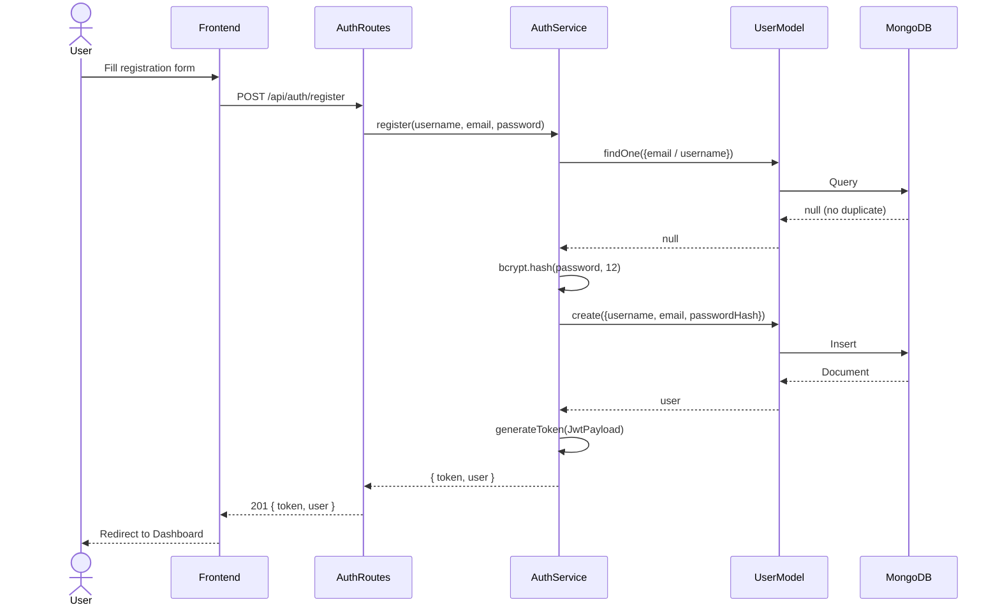
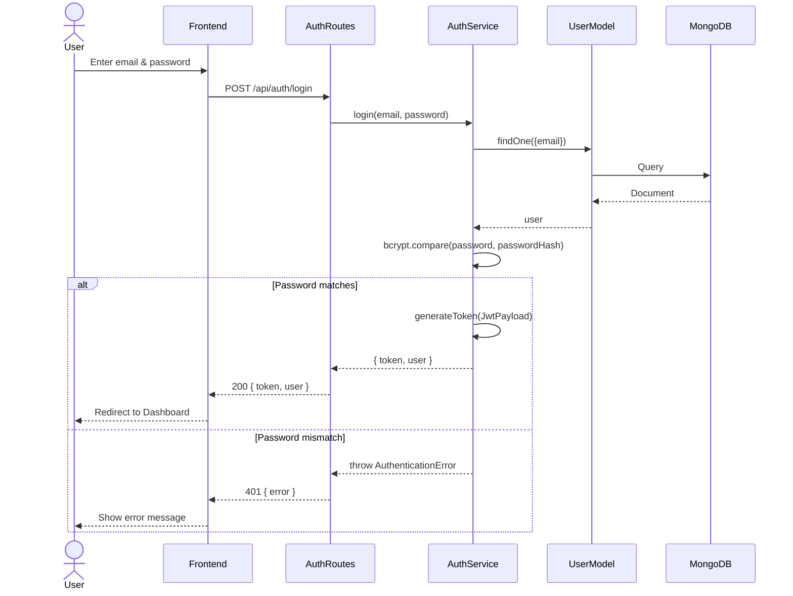
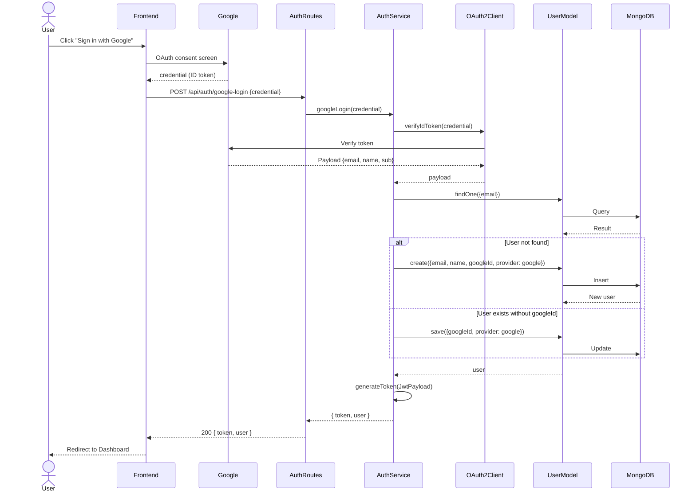
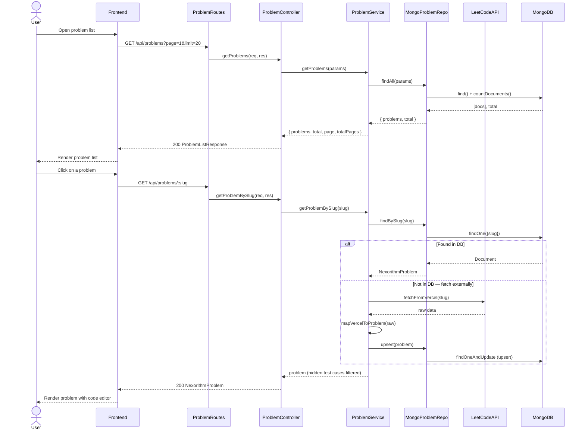
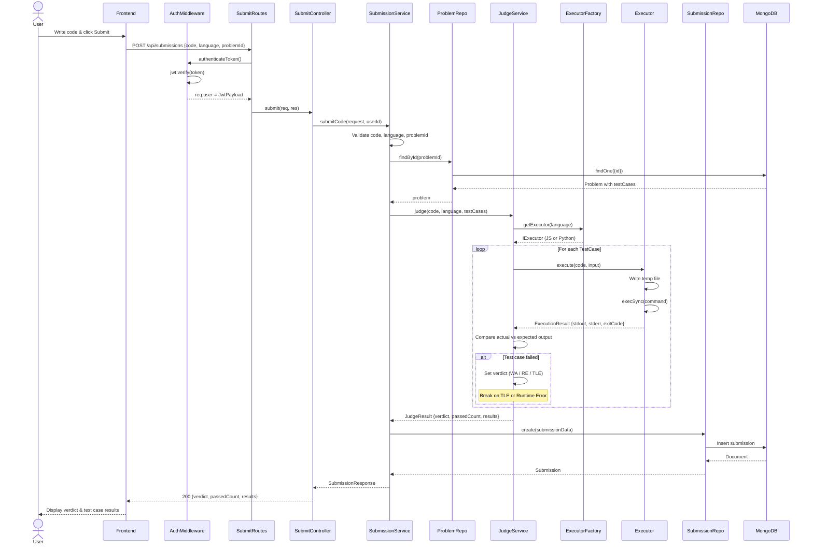
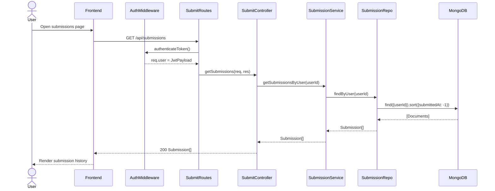

# Sequence Diagrams — Nexorithm Online Judge

## 1. User Registration (Local)

---

## 2. User Login (Local)

---

## 3. Google OAuth Login

---

## 4. Browse & View Problem

---

## 5. Code Submission & Judging

---

## 6. View Submission History

