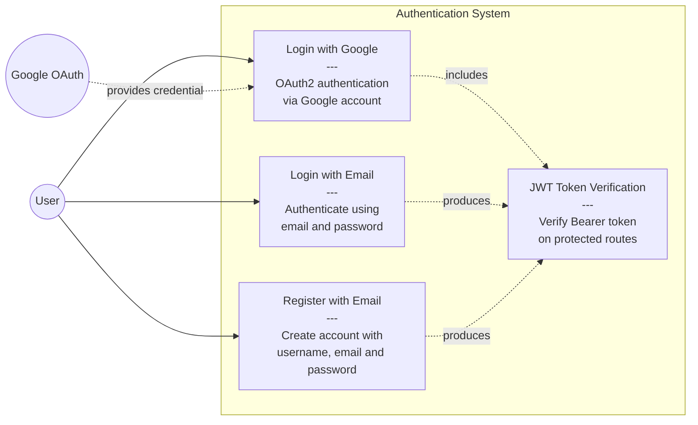
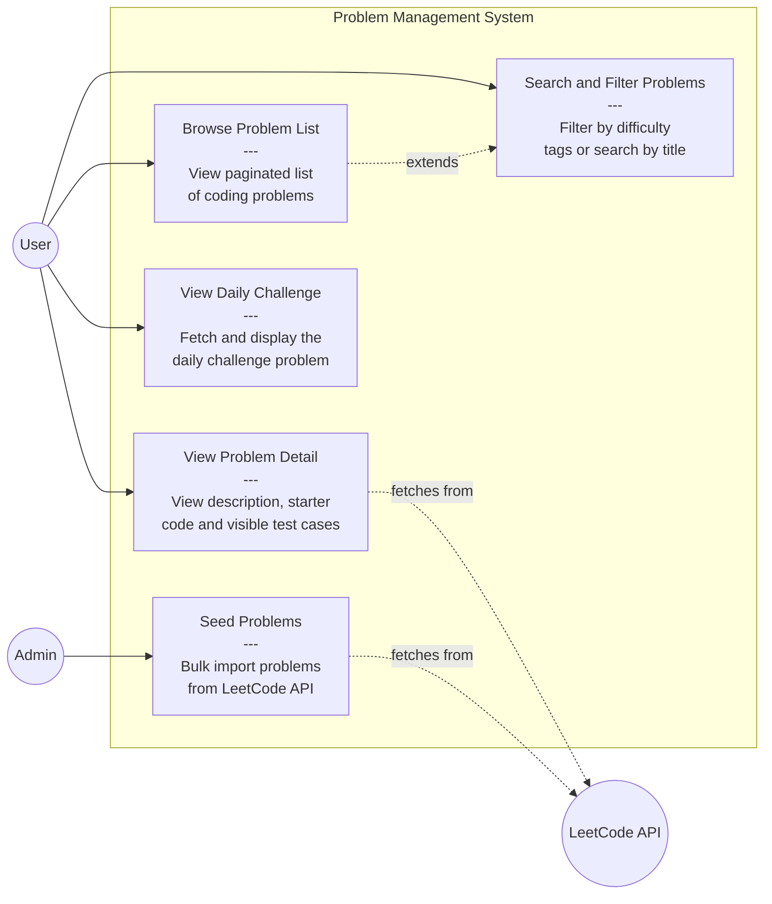
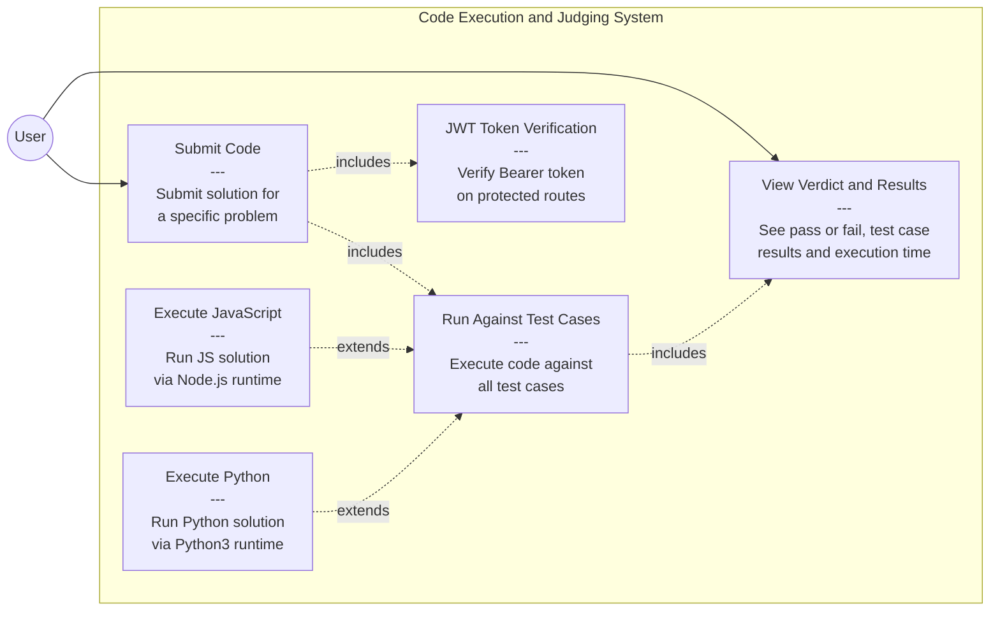
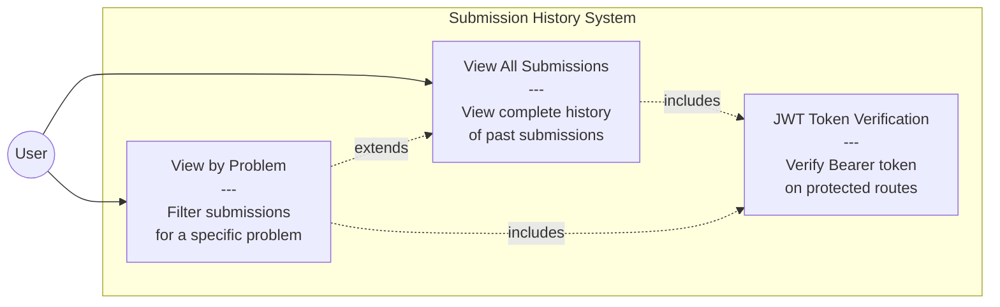

# Use Case Diagram -- Nexorithm Online Judge

## 1. Authentication Use Cases

---

## 2. Problem Management Use Cases

---

## 3. Code Execution and Judging Use Cases

---

## 4. Submission History Use Cases

---

## Use Case Descriptions

### Authentication

| Use Case | Actor | Pre-condition | Description | Post-condition |
|---|---|---|---|---|
| Register with Email | User | Not registered | Create account with username, email, password | JWT token issued, account created |
| Login with Email | User | Registered | Authenticate with email and password | JWT token issued |
| Login with Google | User, Google | Has Google account | OAuth2 flow, auto-create if new user | JWT token issued, account linked |
| JWT Token Verification | System | Token exists | Verify Bearer token on every protected request | req.user populated with JwtPayload |

### Problems

| Use Case | Actor | Pre-condition | Description | Post-condition |
|---|---|---|---|---|
| Browse Problem List | User, Admin | None | View paginated list of problems | Problem list rendered |
| Search and Filter | User, Admin | None | Filter by difficulty, tags, or keyword | Filtered results shown |
| View Problem Detail | User, Admin | None | View full description, starter code, visible test cases | Problem page rendered |
| View Daily Challenge | User | None | Fetch today's daily challenge | Daily problem displayed |
| Seed Problems | Admin | Admin role | Bulk import from LeetCode API | Problems saved to MongoDB |

### Code Execution and Judging

| Use Case | Actor | Pre-condition | Description | Post-condition |
|---|---|---|---|---|
| Submit Code | User | Authenticated | Submit solution code for a problem | Code sent to judge |
| Run Against Test Cases | System | Code received | Execute code against all test cases sequentially | JudgeResult produced |
| Execute JavaScript | System | Language is JS | Run via Node.js with function detection wrapper | ExecutionResult returned |
| Execute Python | System | Language is Python | Run via Python3 with Solution class wrapper | ExecutionResult returned |
| View Verdict and Results | User | Judging complete | See Accepted, WA, RE, TLE, per-case results, timing | Verdict displayed |

### Submissions

| Use Case | Actor | Pre-condition | Description | Post-condition |
|---|---|---|---|---|
| View All Submissions | User | Authenticated | View complete submission history sorted by date | History rendered |
| View by Problem | User | Authenticated | Filter submissions for a specific problemId | Filtered list rendered |

---

## Actor Summary

| Actor | Type | Role |
|---|---|---|
| User | Primary | Solves problems, submits code, views history |
| Admin | Primary | Seeds and manages problem database |
| Google OAuth | External | Provides OAuth2 credential for authentication |
| LeetCode API | External | Source for problem data via Vercel proxy and GraphQL |
